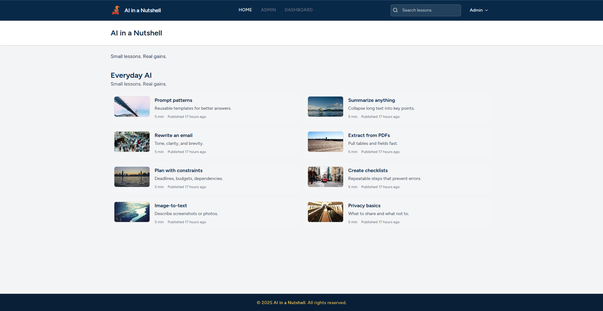

<p align="center">
  
</p>

# AI in a Nutshell

**AI in a Nutshell** is a Laravel-based learning platform that delivers concise, practical micro-lessons on artificial intelligence.  
Each lesson is short, actionable, and designed to build understanding step by step.

---

## Features

- 🧭 Clean and responsive design (Tailwind CSS)
- 🧠 AI lessons organized by chapters
- 📸 Image upload and display for lessons
- 🔐 Secure authentication and user profiles
- ⚙️ Admin dashboard for managing content
- 🔍 Search functionality across lessons
- 🖼️ Custom theme with deep blue and gold accent colors

---

## Prerequisites

- PHP 8.2 or higher  
- Composer  
- Node.js (v18+)  
- npm or yarn  
- SQLite / MySQL / PostgreSQL  
- Git  

---

## Installation

```bash
# Clone the repository
git clone https://github.com/damir-bubanovic/AIInANutshell.git
cd AIInANutshell

# Install PHP and JS dependencies
composer install
npm install

# Copy environment config
cp .env.example .env
php artisan key:generate

# Run migrations and seed data
php artisan migrate --seed

# Create the storage symlink for images
php artisan storage:link

# Start local servers
php artisan serve
npm run dev
```

Now open **http://localhost:8000** in your browser.

---

## Folder Structure

```
app/
  Models/
  Http/
resources/
  views/
  css/
  js/
public/
  images/
  storage/
```

---

## Deployment

For production build:

```bash
php artisan optimize
npm run build
```

Then update your `.env` file:

```
APP_ENV=production
APP_DEBUG=false
APP_URL=https://your-domain.com
```

---

## Example Screens

- Responsive navigation bar  
- Themed login, register, and dashboard pages  
- Chapter and lesson list with image thumbnails  
- Always-visible footer with copyright  

---

## Creator

**Damir Bubanović**

- [DamirBubanovic.com](https://damirbubanovic.com/)
- [YouTube](https://www.youtube.com/@damirbubanovic6608)
- [GitHub](https://github.com/damir-bubanovic)
- [Stack Overflow](https://stackoverflow.com/users/11778242/damir-bubanovic)
- [Yahoo Mail](mailto:damir.bubanovic@yahoo.com)

---

## Acknowledgments

- Built with **Laravel**, **Tailwind CSS**, and **Vite**  
- Refined and styled with the help of ChatGPT  
- Inspired by a goal: *to make AI learning small, fast, and practical*
